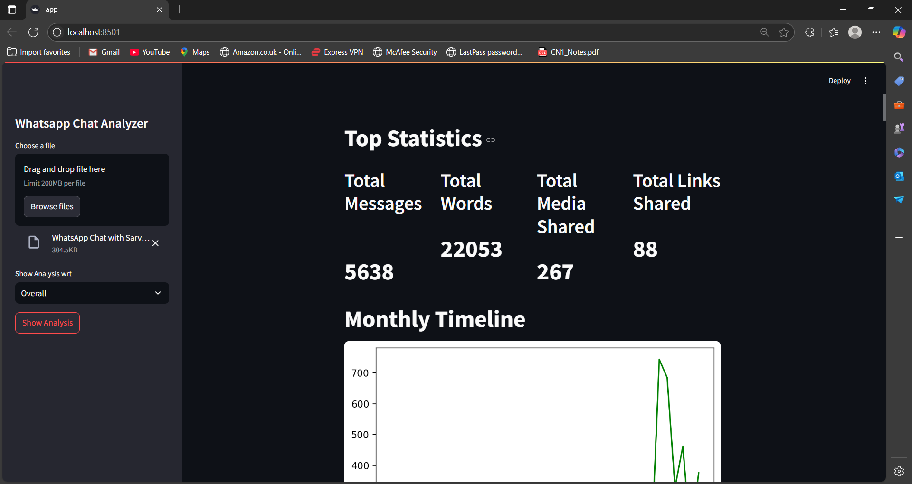
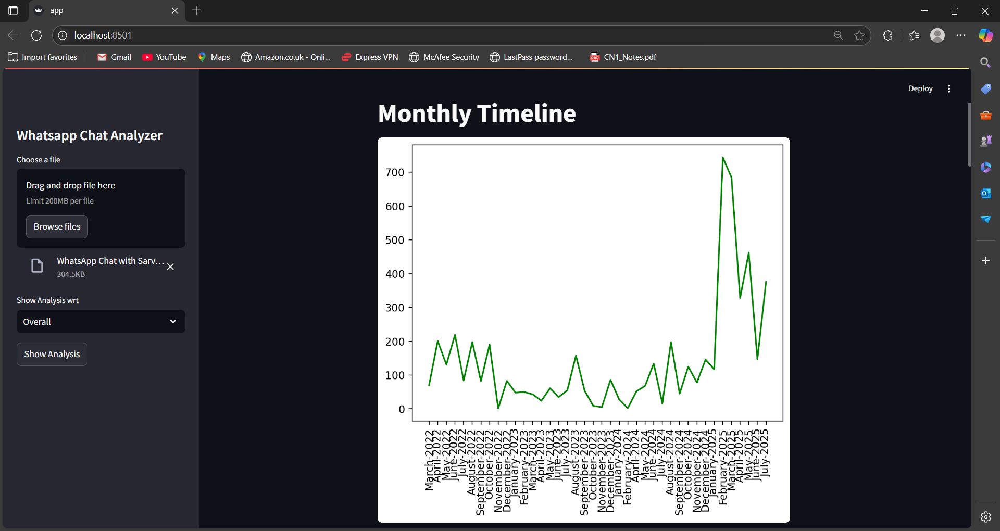
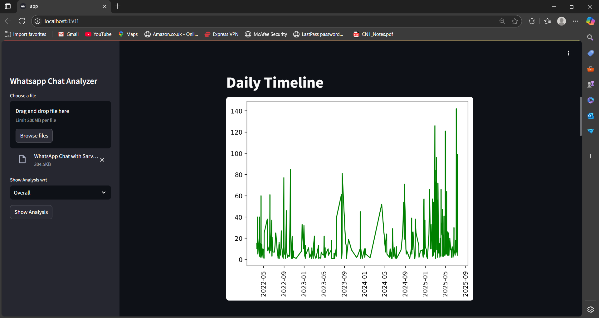
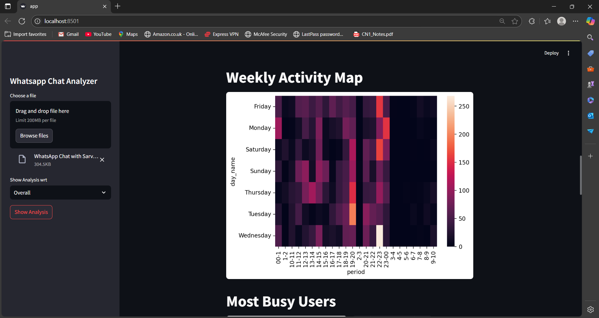
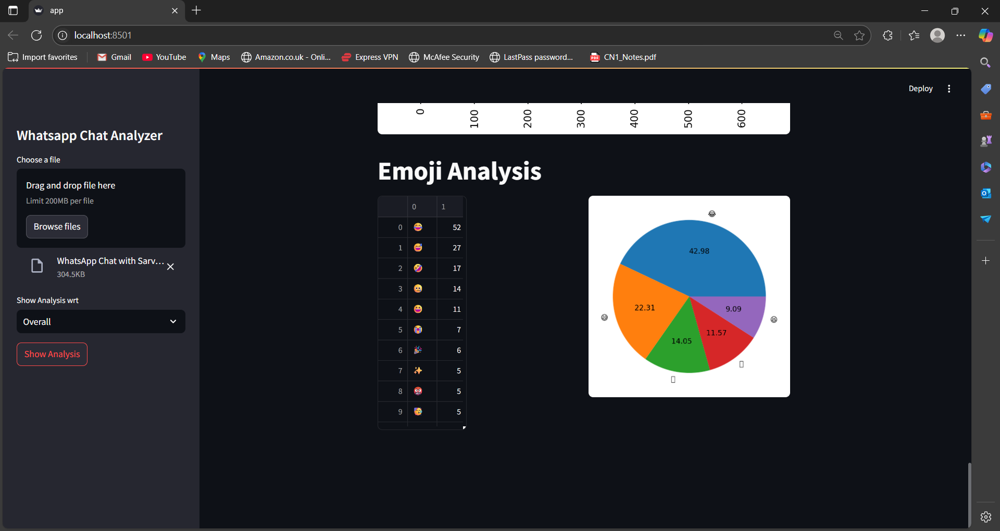
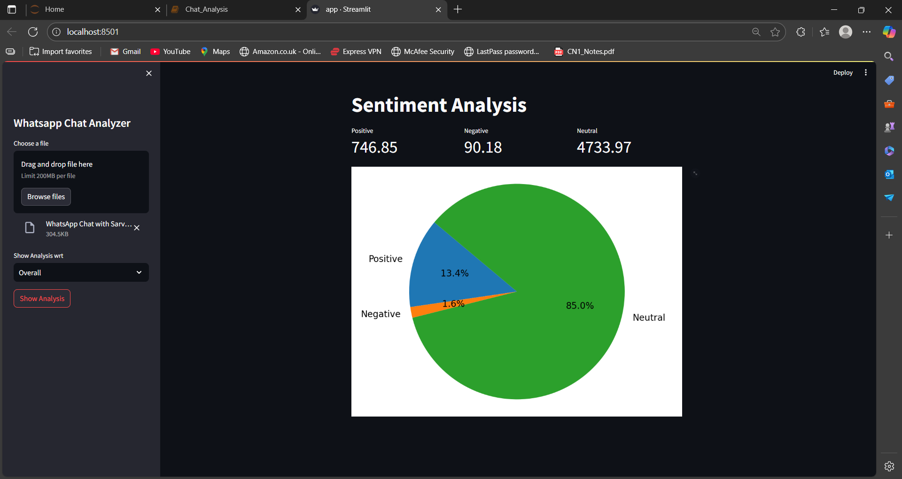

# 💬 WhatsApp Chat Analyzer

A Streamlit-based web application that allows users to upload and analyze their personal or group WhatsApp chat history, extract communication trends, sentiment analysis, and visualize behavior patterns using interactive charts and stats.

---

## 🚀 Project Overview

The **WhatsApp Chat Analyzer** helps users uncover insights from their exported WhatsApp chats. It extracts total messages, word counts, media sharing activity, emojis, links, and more — all presented with clean visuals and timelines. It also includes **sentiment analysis**, enabling users to understand the tone and emotional context of their conversations.

This tool is ideal for exploring personal or group communication trends, identifying your most active hours, users, and frequently used words or emojis.

---

## 🧩 Features

✅ Upload and Analyze Exported WhatsApp Chat Files  
📊 Message, Word, Media, Link & Emoji Stats  
📅 Daily and Monthly Activity Timelines  
🔥 Heatmaps to Show Most Active Days and Times  
🧑‍🤝‍🧑 Identify Most Active Users (Group Chats)  
📝 Frequently Used Words and Emojis  
🧠 **Sentiment Analysis of Chat Messages** (Positive, Neutral, Negative)  
📈 Real-Time Visuals with Streamlit + Matplotlib  

---

## 🛠 Tech Stack

**Programming Language:**  
- Python

**Libraries & Tools:**  
- Pandas (Data Preprocessing)  
- Matplotlib & Seaborn (Data Visualization)  
- Streamlit (Web UI)  
- nltk / TextBlob / VaderSentiment (for Sentiment Analysis)

---

## ⚙️ Setup Instructions

### 1. Clone the Repository
```bash
git clone https://github.com/your-username/whatsapp-chat-analyzer.git
cd whatsapp-chat-analyzer
```

### 2. Create Virtual Environment (Optional)
```bash
python -m venv venv
source venv/bin/activate  # macOS/Linux
venv\Scripts\activate     # Windows
```

### 3. Install Dependencies
```bash
pip install -r requirements.txt
```

### 4. Run the App
```bash
streamlit run app.py
```

### 5. Open in Browser
Visit http://localhost:8501

### ✅ To Screenshot & How it Work:
## 📸 Screenshots

### Use Streamlit for Analysis












---

## 🎥 Demo


